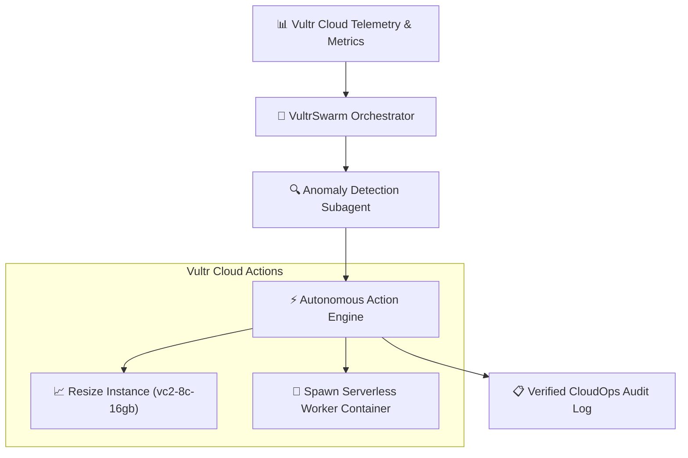

# ☁️ VultrSwarm-Agentic — Autonomous CloudOps & Multi-Agent Swarm

[](https://www.typescriptlang.org)
[](https://opensource.org/licenses/MIT)
[](https://www.vultr.com)
[](./test)

> **Built for the [Vultr: Agent Rush Hackathon](https://lablab.ai/)**

VultrSwarm-Agentic is an autonomous multi-agent cloud infrastructure orchestrator. It continuously monitors Vultr compute clusters, detects CPU/memory anomalies, and autonomously dispatches serverless worker nodes and resource scaling without human intervention.

---

## 🏛️ System Architecture



---

## 🚀 Quickstart & Verification

```bash
# 1. Install dependencies
npm install

# 2. Run unit tests (100% offline verification)
npm test

# 3. Build production bundle
npm run build

# 4. Run autonomous CloudOps audit
npm start
```
